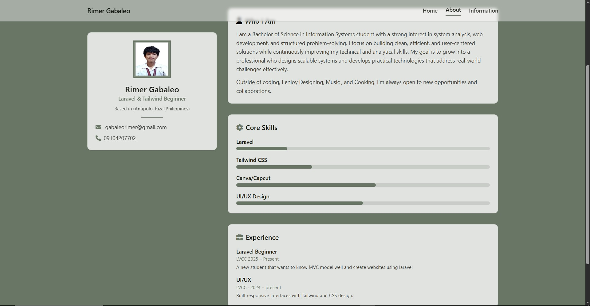
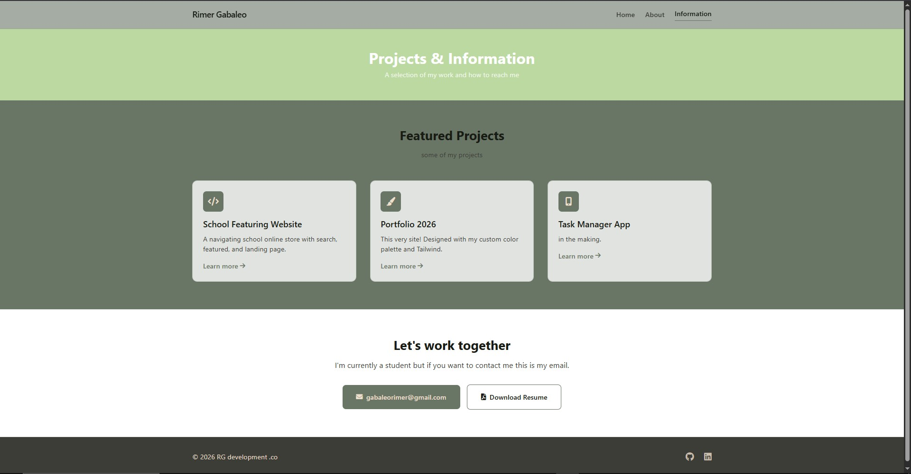

**Laboratory-3-Laravel-Pages-Controllers-and-Routes**

Rimer Gabaleo Portfolio
***A personal portfolio website built with Laravel and Tailwind CSS, featuring a custom color palette (#181C14, #3C3D37, #697565, #ECDFCC). The site consists of three pages: a welcoming Home page, a detailed About page, and an Information page showcasing projects and contact details.***

HOME : 

About:

Information:

**How to Run the Project Locally
Follow these steps to get the portfolio up and running on your own machine.**

Prerequisites
PHP >= 8.2

Composer

Node.js & npm (optional, only if you later want to customize Tailwind locally)

Clone the repository

bash

git clone https://github.com/rimerGAB/your-repo-name.git
cd your-repo-name
----------------------------------------------------------

Start the local development server

bash

php artisan serve
Visit the application
Open your browser and go to http://localhost:8000. The home page should appear.
or you can also click it by doing ctrl + click
-------------------------------------------------------------------------------

Navigate the pages:

Use the links in the navigation bar to explore /about and /information
-----------------------------------------------------------------------

**Customization**
Colors – The palette is applied directly via Tailwind’s arbitrary value syntax (e.g., bg-[#ECDFCC]). To use named colors, extend the tailwind.config.js file and rebuild assets.

Content – Replace placeholder text, links, and the avatar image with your own information.

Avatar – To add a real photo, replace the <i> tag inside the avatar 
 with an  and adjust styling.

**License**
This project is open‑source and available under the MIT license.
